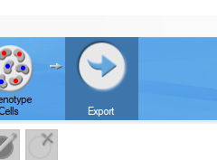
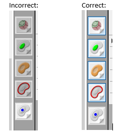
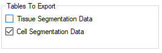
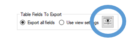
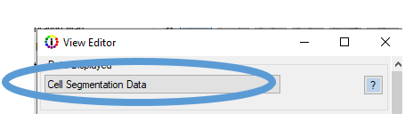
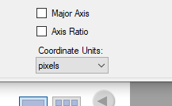
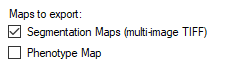
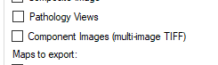

# Saving Projects for the inForm® JHU Processing Farm
# 1. Description 
When the phenotype project is completed, we must apply the proper settings for export and save the algorithm. This ensures that the data output contains all required information and is in the correct format. Failure to apply the proper settings results in having to rerun the algorithms and may cause unexpected behavior in the rest of the pipeline. 

# 2. Instructions
**I. All markers require the cell segmentation data to be exported.**
   1. Go to the export tab  
      
   2.	Be sure that all the analysis annotation layers are turned on  
      
   3.	Under ‘Tables To Export’ select the checkbox next to ‘Cell Segmentation Data’  
      
   4.	Under ‘Table Fields To Export’ select the eye to open the ‘View Editor’       
      
   5.	In the ‘View Editor’, click the drop down menu and select ‘Cell Segmentation Data’  
      
   6. Scroll to the bottom of the page to find ‘Coordinate Units’ and select ‘pixels’
      - You may have to resize the viewer to see this drop-down menu  
      

**II. Select to export the ‘Segmentation Maps (multi-image TIFF)’ for the lineage marker with the lowest numeric opal for each segmentation type.**
1.	For example, in the PD1\ PDL1 axis panel we created a segmentation for immune markers and tumor. The markers were PDL1 (520), CD8 (540), FoxP3 (570), Tumor (620), PD1 (650), and CD163 (690). In this panel we select to export the segmentation maps for CD8 and Tumor. Note that we skip PDL1 since it is usually designated as an expression marker.
2.	Under ‘Maps to export’ select the checkbox next to ‘Segmentation Maps (multi-image TIFF)’  
     
3.	It is very important that all the segmentation layers are checked ‘ON’ when saving the algorithms that export the segmentation maps. If they are not the algorithms will output all layers of the segmentation maps and the data will have to be re-exported.

**III. Select to export the ‘Component Images (multi-image TIFF)’ for the lowest opal antibody (in the above example this would have been the PDL1 algorithm).**
1.	Under ‘Images to export’ select the checkbox next to ‘Component Images (multi-image TIFF)’  
    

**IV. Save the algorithm and project with a unique name that does not use special characters (underscores being the only exception).**

