# Merge a Single Sample (MaSS)
##### <div align="center">***v.0.01.0001***</div>
#### <div align="center">Created by: Benjamin Green<sup>1</sup>, Sneha Berry<sup>2</sup>, Elizabeth Engle<sup>2</sup>, Nicolas Giraldo<sup>3</sup>, Peter Nguyen<sup>2</sup>, Tricia Cottrell<sup>3</sup>, Janis Taube1<sup>2,3</sup>, and Alex Szalay<sup>4</sup></div>
 <div align="center">Departments of <sup>1</sup>Dermatology, <sup>2</sup>Oncology, <sup>3</sup>Pathology at Johns Hopkins University SOM, the Mark Center for Advanced Genomics and Imaging, the Sidney Kimmel Comprehensive Cancer Center, and the Bloomberg~Kimmel Institute for Cancer Immunotherapy at Johns Hopkins, Baltimore, MD, USA</div>
 <div align="center"> Departments of <sup>4</sup>Astronomy and Physics at Johns Hopkins University and IDIES, Baltimore, MD, USA</div> 
 <br>
 
Individual Contributions: **Benjamin Green**: Conceptualization, Methodology, Software, Writing – Original Draft, Visualization **Sneha Berry**: Conceptualization, Validation, Visualization, Writing – Review & Editing **Liz Engle**: Conceptualization, Resources **Nicolas Giraldo-Castillo**: Conceptualization **Peter Nguyen**: Conceptualization, Methodology **Tricia Cottrell**: Conceptualization, Validation, Writing – Review & Editing **Janis Taube**: Conceptualization, Supervision **Alex Szalay**: Conceptualization, Methodology, Validation, Software, Supervision

#### <div align="center">Correspondence to: bgreen42@jh.edu</div>

## ***Section 1: Contents***
1. [Contents](#section-1-contents "Title")
2. [Summary](#section-2-summary "Title")
3. [Workflow Description](#section-3-workflow-description "Title")
4. [Merge Configuration File Structure](#section-4-merge-configuration-file-structure "Title")
5. [Image and Table File Structure](#section-5-image-and-table-file-structure "Title")
6. [Installation and how to run](#section-6-installation-and-how-to-run "Title")
7. [Output](#section-7-output "Title")
8. [Create Image QA QC utility](#section-8-create-image-qa-qc-utility "Title")

## ***Section 2: Summary***
Merge a Single Sample (MaSS) is an executable utility, written and compiled in MATLAB that facilitates the analysis of multiplex immunofluorescence imaging data. Specifically, it merges a set of binary phenotype classifications for individual markers created by the inForm® (Akoya Biosciences®) phenotype module into a single coordinate system, enabling the so-called 'multipass' method for mIF cell classification. With this method each cell type is both segmented and classified separately, thereby reducing the segmentation error caused by cell size variation and decreasing the complexity of classifying high plex panels where many different coexpressions can exist. By  In order to minimize over-segmentation and reconcile different cell segmentation algorithms the code satisfies the condition that only one cell is identified within 6 pixels of any other cell call, a distance that is measured between cell centers. To reconcile conflicting phenotypic classifications of the same cell, a hierarchical decision tree is used to determine which phenotypes will persist. The decision tree is embedded in the user defined [merge configuration file](#section-4-merge-configuration-file-structure "Title") along with information about the panel and pre-processing analysis. With this file and *a priori* information about the panel, the user can alter the behavior of marker interactions; specifying things like acceptable coexpressions, mutual segmentation algorithms, and even allowing multiple segmentation algorithms for a single marker. The utility was designed to run across a set of images in the [predefined folder structure](#section-5-image-and-table-file-structure "Title"). This document further details the steps involved in phenotype clean up and instructions on implementing the code.

## ***Section 3: Workflow Description***
In order to run the executable, each marker in the multiplex panel must have separate classification table. This table should be in the ‘cell segmentation data’ export format as provided by the inForm®'s phenotype module. Each output for a specified marker, should have two defined phenotypes; one as the antibody name, i.e. ‘CD8’, and ‘Other’, case is not important. The data should be in the format defined [here](#section-5-image-and-table-file-structure "Title"). Tips on how to configure an InForm® project for compatibility with the MaSS program are defined at the end of [Section 4](#section-4-merge-configuration-file-structure "Title") and, in more detail, the accompanying protocol document [inForm Multipass Phenotype]. After the data has been exported and set in the proper format the merge configuration file for the batch must be created, directions on that file is located [here](#section-4-merge-configuration-file-structure "Title"). As mentioned above, this file will help define settings for how each antibody will be treated in the hierarchical merge, it also provides the code with useful metadata like which markers are in the panel and which opal each marker is in. 

Once the data files are set up correctly, the code can be executed. The following part of this document will be used to define the logic steps taken to merge the cell data into a single coordinate system and is included for interested readers\ transparency. First, we define lineage markers and expression markers. Lineage markers, individually or in combination, are used here to define specific cell phenotypes. Expression markers are those that can be expressed on multiple cell lineages, usually at varying levels. Next a primary segmentation is defined, this segmentation is labeled as Segmentation Hierarchy: 1 in the merge cofiguration file. This segmentation should perform well on the majority of cell types featured in the panel. This is also where the ‘Other’ cell classification cell information, including x / y coordinates and intensity information, will come from. Secondary segmentation algorithms can be tailored for cells that do not segment well using the primary algorithm, i.e. larger tumor cells or machrophage. Following this all cells within 6 pixels of one another (~3um) are found. Cells without any lineage phenotype classification in a radius of 6 pixels are classified as ‘Other’, the rest of the cells in the 'Other' population are dropped. Following this, cells that are within 6 pixels of each other and are of the same type are collected. It is assumed that these are actually the same cell, so one of the cells should be removed. For these combinations, the code removes cells with lower total expression marker intensity. In the merge configuration file, cells may be designated to predominately express a specific expression marker; in this case priority is placed on that expression marker.

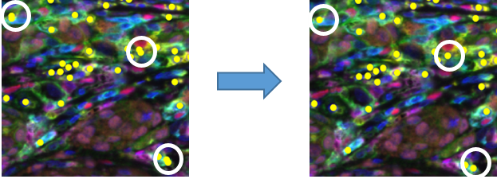

Next, the code resolves cells with different lineage phenotypes within the 6 pixel radius of each other using the segmenation hierarchy, defined in the merge configuration file. For the hierarchy each lineage should be ranked by the following factors:
1. Uniformity of staining: Some cell markers\ antibodies have more uniform and well-defined staining patterns.
2. Uniformity of cell type: Some cells have patterns that are easier to distinguish and thus greater confidence should be given to the phenotype of these cells.
3.	Shape of cell type: Some cells have different shapes that make them easier or harder for segmentation and classification algorithms to correctly identify. 
4.	Importance of cell type in analysis: Some cells are more or less biologically significant, thus we should make better attempts to allow for the capture these cell types.

For conflicting phenotype classifications found, cells with a higher numeric value in the hierarchy will be removed. An example of this is shown below, where a CD8 cell (yellow) collides with CD163 (magenta) cell classifications Here, the result phenotype image shows that the CD8 classification is kept and the CD163 classification is dropped:

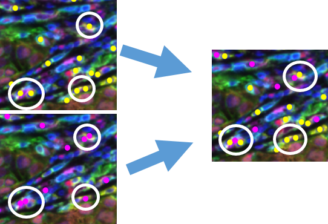

During this protocol, we also search for cell lineage classifications which collide but are defined as "acceptable coexpression" in the merge configuration file. For these cells, the phenotypes are relabeled; combining the 'Target' names of the two markers in reverse numeric opal order. For example, if we allow for CD8+ FoxP3+ coexpression where CD8 was in 540 and FoxP3 in 570, the resulting phenotype would be defined as FoxP3CD8 for colliding cells. 

After this, a final clean up protocol is performed on the data wherein 'Other' cells with cell centers inside the membrane of any lineage cells are removed. This clean up protocol is one of the most important features of this software. Take for instance, a large tumor cell that is well segmented and correctly defined positive by our algorithm, but we define the primary segmentation on smaller immune cells. That large tumor cell will be oversegmented in the immune cell segmentation. While, these oversegmented cells  should be given the phenotype classification of 'Other' cells they are only removed if they collide within 6 pixels of the provided tumor cell center. The result of this is a single tumor call, but an overestimation of the 'Other' cells in the image. Additionally, assignment of the expression marker to a given cell, described below, becomes uncertain. Note that in this case, the tumor cell cannot be relied on as the primary segmentation in this case because a majority of the non-labeled cells in tissue are more likely to be immune cells than tumor. A visual example of this clean-up protocol is shown below; where the 'Other' cells are defined by the white dots and the 'Tumor' cells by the orange dots: 

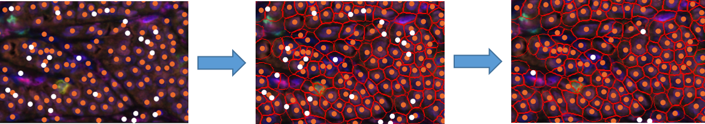

Finally, the code assigns positive expression marker phenotype calls to the cell objects their cell centers are contained in. Expression marker phenotypes with cell coordinates inside two cell membranes are assigned to the closest lineage cell, based on cell centers. 

## ***Section 4: Merge Configuration File Structure***
Merge Configuration file is a csv spreadsheet which indicates how the markers will be analyzed and merged to a single coordinate system where only one phenotype call exists for each cell. Columns are defined below, column names are case senstitive. Mark fields that do not have a designation as NA in character columns and 0s in numeric columns. 

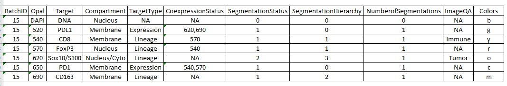

1. ```BatchID[int]```: indicates which batch the slides were stained in. This variable is used a record keeping method and does not indicate settings in the merge code
2. ```Opal[int]```: should be the name of the Fluor which targets a given antibody
   a. stains should be added in numeric order starting with DAPI
3. ```Target[string]```: name if the antigen the applied antibody is targeting
   - name does not need to be very technical by should unique
   - the name should also be used for:
      - the opal labels in inForm®
      - the positive phenotype for each marker
      - the folder for each of the separate inForm® outputs
      - **Exception**: the tumor marker (also designated in ImageQA)
        - For this marker, use 'Tumor' to desgnate the output folder
        - Optionally: use 'Tumor' when desgniating that antibody in inForm®. 
        - Must use same name for phenotype and opal namings
4. ```Compartment[string]```: The cell compartment from the inForm® tables to use when loading in the database. Options include ```EntireCell```, ```Membrane```, ```Nucleus```, and ```Cytoplasm```. Markers specified as ```Nuclear``` may have a different color '+' in the QC images than the specified color below to increase visibility.
5. ```TargetType[string]```: 'Lineage' or 'Expression'
   - 'Lineage'
     - use this to denote markers that define the cell type\ function (e.g. Macrophages, TCells, Tumor cells, Tregs)
   - 'Expression':
     - Markers that may be expressed at varying levels on many given cell types (e.g. PD1, PDL1) and will not affect the phenotype call of other cells 
6. ```CoexpressionStatus[float]```: **different for Expression and Lineage phenotypes**
   - *Exrpression markers*: input the opal dyes of the lineage marker(s) it predominately co-expresses with
     - e.g. PD1(650) may co-expresses predominantly with CD8 (540) and FoxP3 (570), add 540,570 to this input for PD1
   - *Lineage markers*: input the opal dyes of **other Lineage marker(s)** that will be allowed to co-express with the specified marker
     - e.g. if CD8+ (540) - FoxP3+ (570) cells are accepted; in the CD8 row add “570” for FoxP3 and in the FoxP3 row add “540” for CD8
7. ```SegmentationStatus[int]```: This is a numeric value; 1-X for the different types of segmentation that may exist, each marker with the same number should be processed with the same cell segmentation algorithm in inForm®
   - e.g. for a specified panel all markers may have the same segmentation and would have (1)s except Tumor which would have (2)s
   -	The primary segmentation (1) should be the more reliable algorithm and usually correspond to smaller cells
   -	“Other” cells will be defined by the primary segmentation (1)
8. ```SegmentationHierarchy[int]```: *For Lineage markers only*; create an order of phenotypes/ segmentation you believe will be most accurate – this is primarily based off of cell morphology 
   -	Use NA for expression markers
   -	The code will remove cells according to this column
     - lower cells take precedence over higher number cells when they collide
     - e.g.: A cell given a positive phenotype for CD8 in the CD8 algorithm and positive for CD163 in the CD163 algorithm; if CD8 (1) is ranked higher than CD163 (2) then the CD163 designation will be removed
   - Only cells that are allowed co-expression should have the same number. If two cells co-express with the same cell but not each other (CD4-FoxP3 and CD8-FoxP3); use the higher number for one of the two cells (CD4 or CD8) and the double co-expressed cell (FoxP3). Use a lower number for the other cell (CD4 or CD8). In the example with CD8-CD4-FoxP3 we usually use the numbers 1-2-1. CD4-FoxP3 will still be found based off of co-expression status but CD8-FoxP3 cells will take precedence.
9.	```NumberofSegmentations[int]```: this value indicates how many segmentations were used for each antibody
    - as of the current update this setting is only supported on markers designated as ‘expression’
    - lineage cells that are from separate segmentations but are allowed to coexpress will create unexpected results 
10.	```ImageQA[string]```: This column allows a user to set 2 different conditions of the batch
    -	'Immune': The user can set one cell type as the ‘Immune’ cell 
      - Fields with the highest density of this cell type will be selected by the CreateImageQAQC algorithm to be assessed
      - there needs to be at least one and only one of these designations for the MaSS code to work
    -	'Tumor': The user can set one cell type as ‘Tumor’
       - This is an optional field and will tell the code to narrow down the QA to fields to only include those with more than 60 of this cell type
       - There can be only one cell of this type
    -	Only set one marker as ‘Immune’ and only one marker as ‘Tumor’
11. ```Colors[string]```: specify the colors for the create image qa qc protocol. Colors can be specified by the color name or abbreviations below.
    - Options: 'red','green','blue','cyan', 'magenta','yellow','white','black','orange','coral'
    - Abbreviations: 'r','g','b','c','m','y','w','k','o','l'

## ***Section 5: Image and Table File Structure***
The code relies on a data organization format detailed below:<br>
```
+--	DIR\ inform_data 
| +-- Component_Tiffs
| +-- Phenotyped:	add a folder for each  Antibody (ABx) in the panel
| | +-- ABX1 (e.g.	CD8)
| | +-- ABX2 (e.g.CD163)
| | +-- ABX3 (e.g.FoxP3)
| | +-- ABX4 (e.g.	Tumor)
| | +-- ABX5 (e.g.PD1)
| | +-- ABX6 (e.g.PDL1)
```

- The antibody names here should correspond to those names used in the merge configuration table. 
  - The only exception is the ‘Tumor’ marker which, if designated in the ImageQA column of the merge configuration table, should be label ‘Tumor’ here. 
- If the folder names do not correspond to the Target names the code will produce an error to check the inForm® files
  - Note: these names are all case sensitive

In each corresponding antibody folder, export the cell segmentation data tables, *_cell_seg_data.txt*, that inForm® outputs for a phenotype analysis. In the lowest numeric Opal of each segmentation type (described in the [merge configuration section](#section-4-merge-configuration-file-structure "Title")), also export the binary segmenation maps, *_binary_seg_maps.tif*, from inForm®. These are label matricies corresponding to the cells. Please be sure these files have four layers:
1. Tissue Segmentation
2. Nuclear Segmentation
3. Cytoplasmic Segmentation
4. Membrane Segmentation

Finally, add all the Component data, *_component_data.tiff*, images from the inForm® export for each field analyzed into the *Component_Tiffs* folder

## ***Section 6: Installation and how to run***
The executable is available on github either as a matlab function or as a deployable application. The inputs to both are the same, here we only describe the instructions for uses as a deployable application.
1.	install the application on the desired computer by opening the distributed file ‘MaSS Installer.exe’ and following the onscreen prompts. MATLAB does not need to be installed for the software to work.
    - The installer will download and install a version of MATLAB runtime if it is not already installed on the computer. Note that the code will run off of whatever drive the runtime is installed on. Furthermore, if the runtime is installed on the wrong drive, using windows, uninstall the application and MATLAB runtime instance, then reinstall 
2.	Once installed, run from the command line as: 
    -  ```CALL *\MaSS.exe wd sname mergeconfig [logstring] ```
        - ```wd(string)```: working directory up to the *inform_data* folder
        - ```sname(string)```: specimen name
        - ```mergeconfig(string)```: fully qualified path to the merge configuration file
        - ```[logstring](string)```: optional logstring arguement; used in the clinical specimen astropath pipeline, adds string to the start of each log line. Be sure to end the string with a ';' to ensure proper separation in the log messages
    - E.g. ```CALL "C:\Program Files\Astropath\MaSS\application \MaSS.exe" "*DIR \inform_data" "MXX" “*DIR \MergeConfig_XX.xlsx”```
      - Replace ```*DIR``` with the corresponding paths, ```MXX``` with the sample name, and ```MergeConfig_XX``` with the name of the merge configuration file. Unless changed during installation the path to the executable will be ```‘C:\Program Files\Astropath\MaSS\application’```. If the installation path is different, this should also be changed. Once started, the code will generate a resulting .csv for every image on the ```inform_data``` folder
3. Tips for defining file structure, generating files, and creating projects
   - Be sure to name the opals on the prepare tab in inForm®.  	
   - When naming the opals, use the same names as indicated in the file structure and the ‘Target’ column of the BatchID table. 
   -	The labels in inForm® will not be case sensitive
   -	For the Tumor marker, indicated by column 14, use the designation ‘Tumor’ instead of the full name, this is only required when creating the output folders, but may be useful in all aspects of this analysis
   -	Refrain from using any illegal characters like ‘\’ or ‘-‘ 
   - When creating the tissue segmentation, include at least two categories labeling one as ‘NonTissue’
   - When creating the cell segmentation algorithm be sure to check the boxes for ‘Membrane’, ‘Nucleus’, and ‘Cytoplasm’
   -	For the membrane segmentation outputs be sure that there are 4 layers 
   - *if inForm® is not exporting all layers to binary segmentation*
     - open the project or algorithm in inForm®
     - add and process an image to the export tab 
     - click all segmentation layers to be visible and save the algorithm again, then use this algorithm to export the phenotype analysis
     
## ***Section 7:	Output***
The code outputs results tables into a ```*DIR\ inform_data\Phenotyped\Results\Tables``` folder which is created upon startup. The resultant tables have the same name as their corresponding images but contain the extension: ```*_cleaned_phenotype_table.csv``` after their image coordinates. The code also creates a MaSS.log file in this folder.
This table contains 62 columns: 
   - CellID – a unique cell id for each cell
   - SlideID – the slide name
   - fx & fy – x and y pixel coordinates of the field centers
   - CellNum – the inForm® unique cell id ( which may be rendered non-unique if  multiple segmentation algorithms are used)
   - Phenotype – cell lineage classification string corresponding to Lineage ‘TargetType’ ( described in the BatchID section)
     - Each cell will have only one phenotype lineage unless it is included in a ‘CoexpressionStatus’ lineage pair in the BatchID table (described further in the BatchID section)
     - In this case the phenotype will be presented as a string of ‘highest opal antibody’’lowest opal antibody’ 
     - Ex:
       - CD8 – 540; FoxP3 – 570
       - ‘FoxP3CD8’ 
   - CellXPos & CellYPos – cell x and y pixel coordinates relative to the image
   - EntireCellArea – Area of the cell in pixels
   - Next are the intensity columns for each cell: 
     - For each opal there will be columns named as follows – where XXX is the opal number DAPI, 480, 520, 540, 570, 620, 650, 690, 780
       - MeanNucleusXXX 
       - MeanMembraneXXX
       - MeanEntireCellXXX
       - MeanCytoplasmXXX
       - TotalNucleusXXX 
       - TotalMembraneXXX
       - TotalEntireCellXXX
       - TotalCytoplasmXXX
     - The columns are ordered by category and then opal such that all MeanNucleusXXX columns come before MeanMembraneXXX columns and so on
     - These columns may contain NULL values but are otherwise float32
     - A negative 1 value indicates that the opal was not used in the panel
   - ExprPhenotype - the expression marker bit integer value, the values correspond as follows
      - DAPI: 0
      - 480: 2
      - 520: 4
      - 540: 8
      - 570: 16
      - 620: 32
      - 650: 64
      - 690: 128
      - 780: 256 <br>
      
      
The code also produces a folder named ```*\Results\tmp_inform_data```, which contains .mat files for the images that meet the Image QA criteria, detailed below. These .mat files contain a copy of the ```*_cleaned_phenotype_table.csv``` in an easily accessible MATLAB format.

## ***Section 8: Create Image QA QC utility***
v.0.01.001
### Section 8.1 Description/ running instructions
In order to assess the performance of the cell phenotype algorithms on a large quantity of images, an algorithm was developed to selectively sample images and create modified visual displays of those images. This algorithm is a secondary application which must be downloaded and installed separately, it is called CreateImageQAQC. This code must be run after the MaSS protocol as it relies on the tmp_inform_data directory the MaSS tool creates. The code is relatively simple to run from a cmd prompt using the following:
- ```CALL *\CreateImageQAQC.exe wd sname mergeconfig [logstring] [allimages] ```
  - ```wd(string)```: working directory up to the *inform_data* folder
  - ```sname(string)```: specimen name
  - ```mergeconfig(string)```: fully qualified path to the merge configuration file
  - ```[logstring](string)```: optional logstring arguement; used in the clinical specimen astropath pipeline, adds string to the start of each log line. Be sure to end the string with a ';' to ensure proper separation in the log messages
  - ```[allimages](int)```: optional arguement to export QC on all images (1) or just the top 20 'hotspots' (0/ default). For this option, also pass a logsting agruement to the function as the variables are location specific in the function call
- E.g.: CALL "C:\Program Files\Astropath\ CreateImageQAQC \application \ CreateImageQAQC.exe" "*DIR \inform_data\Phenotyped" "MXX" “*DIR \BatchID_XX.xlsx”
  - Replace ```*DIR``` with the corresponding paths, ```MXX``` with the sample name, and ```MergeConfig_XX``` with the name of the merge configuration file. Unless changed during installation the path to the executable will be ```‘C:\Program Files\Astropath\MaSS\application’```. If the installation path is different, this should also be changed. 

### Section 8.2 Workflow Description
The code first selects images for quality control based on user specifications. Only, images containing at least 60 tumor cells and images with at least 75 percent tissue coverage are considered for each sample. If a tumor cell designation is not included in the BatchID table, the tumor cell search criteria is removed. If less than 20 fields in the sample meet the search criteria, the minimum tissue coverage requirement is reduced by 6.25 percent. This is repeated until 20 fields meet the search criteria or the field tissue coverage search criteria decreases below 50 percent. If 20 fields or less than 20 fields are selected then performance testing is carried out on all fields. If more than 20 fields are selected, then the 20 highest designated ‘Immune’ cell density fields are selected for performance testing.

To assess assigned co-expression, pie charts are created to show cell proportions in each field, shown on the left. The first pie chart shows portions of all cells in the field, while the others display the proportion of cell lineages expressing each expression marker type. In this way, it is easy to see if expression patterns assigned correlate with current biological understanding of antibody performance. A heat map of log2 detected mean intensity in cells vs their assigned lineage phenotypes is also generated. When the phenotype algorithms are performing correctly high opal intensity should correlate with the marker it is labeling. For example, CD8 is labeled by Opal 540, if the phenotype is performing well there should be high intensity in the Opal 540 - CD8 rectangle. 

While these metrics aid in performance assessment, visual inspection is the final verdict. To do this cell stamp mosaics are generated for each marker. In each mosaic, 50 cell stamps are randomly sampled from the image, 25 of which were centered on positive cells and 25 centered on negative cells. In these image stamps, the image segmentation in red as well as a grey scale of the component being detected is displayed. In order to assess the global context and performance of cells in each image, full size composite images are also generated. Full size composites are generated displaying each antibody separately as well as together, both with and without the segmentation overlaid on top. 

### Section 8.3 Output

The code creates output into a QA_QC subfolder under the ```*DIR\MXX\inform_data\Phenotyped\Results``` folder created in the MaSS protocol. For the images, the color-marker pairs are indicated in a legned at the bottom left hand corner of the image. Assigned phenotypes are shown by the dots overlaid on the image. Lineage markers assignment is designated by the color of the circle while expression markers are designated by the horizontal strips of each cell. Coexpressing lineages, ('CD8FoxP3') are designated by half dots where the top half indicates one marker and the bottom half indicates the other.

- Tables_QA_QC (subfolder):
  - These are the MaSS results tables for these images (ext. '_cleaned_phenotype_data.csv'), placed here for referencing convenience if further testing is desired
- QA_QC.log
  - This log file details the number of hotspot fields chosen, as well as time stamps for the image output and completion time of the program
- Phenotype (subfolder):
  - All_Markers (subfolder): three types of image output, designated by the following extensions after the image coordinate brackets
    - ‘_cleaned_phenotype_image’
      - This image shows the full color image with all component layers on and phenotype classification markers on all cells (see above for description) <br>
       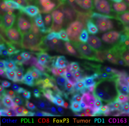
    -	‘_cleaned_phenotype_w_seg’
        - This is image is the same as the image above except that is has the 'combined' segmentation map overlaid on top <br>
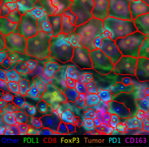
    -	‘_composite_image’
        - This image displays the full color image, with all component layers, but without the dots indicating phenotype <br>
        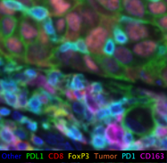
  - There will also be a sub folder for each lineage and expression marker designated, these folders allow a performance assessment of  individual markers
    - This includes a folder for any combination lineage markers designated in the ‘CoexpressionStatus’ from the merge configuration table
    - The folders will be labeled by antibody; e.g. separate folders labeled 'CD8', 'PD1'
    - There are 8 types of images, designated by different strings after the image names. The first four images are a collection of cell stamp mosiacs, the other four images show the image in full as in the 'All markers' folder but only display the marker of interest. Full details on each view are provided below.
     - Cell mosiacs: 
       - Each mosiac is centered on either a positive or negative cell. A 50x50 pixel board has been cut out around the cell so that the cell of interest in the middle of the cell stamp
        -	The white crosses indicate positive cells for the marker of interest
        -	Up to 25 positive cells for the current marker are randomly sampled from the image and displayed first, with 25 negative cells displayed afterward
          - If less than 25 cells of this type exist we show all positive cells. If none exist, images of this type are not exported
        - For coexpressing lineages, since there is more than one expression pattern, images below labeled as grey scale will instead be in the colors defined by the merge configuration file
      -	‘_cell_stamp_mosaics_pos_neg’
         - These include the cell segmentation, DAPI, and a grey scale of the component expression overlaid <br>
          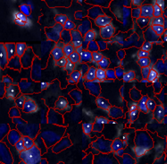
      -	‘_cell_stamp_mosaics_pos_neg_no_dapi’
        -	These include the cell segmentation and a grey scale of the component expression overlaid, with DAPI removed to increase visibility <br>
         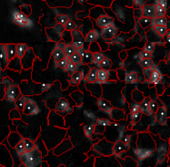
      -	‘_cell_stamp_mosaics_pos_neg_no_seg’
        - These include the DAPI and a grey scale of the component expression overlaid, with the segmentation removed to increase visibility<br>
        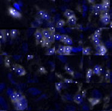
      -	‘_cell_stamp_mosaics_pos_neg_no_dapi_no_seg’
        - These include a grey scale of the component expression overlaid, with the segmentation and DAPI removed to increase visibility<br>
        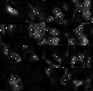
      -	‘_full_color_expression_image’
        -	Full image with all component layers and segmentation overlaid
        -	The color-marker pairs are indicated in the bottom left hand corner of the image
        -	The white crosses indicate positive cells for the marker of interest <br>
         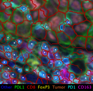
      -	‘_full_color_expression_image_no_seg’
        -	Full image with all component layerr, *without* the segmentation overlaid
        -	The color-marker pairs are indicated in the bottom left hand corner of the image
        -	The white crosses indicate positive cells for the marker of interest 
      -	‘_single_color_expression_image’
        -	Full image  of the component layer of the marker of interest in *grey scale*, DAPI, and segmentation overlaid
        -	The white crosses indicate positive cells for the marker of interest <br>
        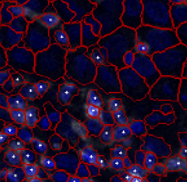
      -	‘_single_color_expression_image_no_seg’
        -	Full image  of the component layer of the marker of interest in *grey scale* and DAPI *without* the segmentation overlaid
        -	The white crosses indicate positive cells for the marker of interest <br>
        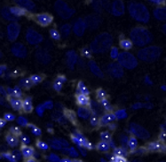
- Lin&Expr_Coex (subfolder):
  - Here there will be a folder for each defined lineage marker. 
  - Inside each folder will be a set of 8 images as desribed in the 'individual markers section'. These images are designed to assess the coexpression of each lineage with each defined expression marker. 
  - In the single color gray scale images, the lineage marker is still in grey scale but the expression marker is in the color designated by the merge configuration file. 
