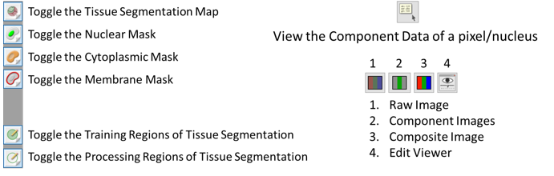
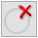
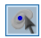

# inForm® Multipass Phenotype
## 1. Description
This is the protocol for defining cell segmentation and classification algorithms for the so-called 'multipass' method to mIF cell classification using the inForm® (Akoya Biosciences®) phenotype module. In this approach, a user creates separate inForm Cell Analysis® algorithms for each anitbody in the panel. The base algorithm for unmixing and tissue segmentation should be the same but the cell segmentation and classification can be tailored to each antibody individually. We believe this method reduces the segmentation error caused by variation in cell size and decreases the complexity of classifying high plex panels where many different coexpressions can exist. After all images are processed by each antibody algorithm, image data can be merged into a single file using the Merge a Single Sample (MaSS) utility. This utility defines coexpressions and merges the data into a single coordinate system. The algorithm satisfies the condition that only one cell is identified within 6 pixels of any other cell call, a distance that is measured between cell centers. In other words, cells identified within 6 pixels of each are in fact the same cell and the data should be merged in some way across the different antibody algorithm outputs. Details on the merge can be found in the associated code documentation. Settings for the merge should be defined in a *MergeConfig_NN.xlsx* file defined in the merge documentation.

## 2. Instructions
### 2.1. Getting Started
1. Launch inForm Cell Analysis®
2. Open correct library algorithm
   - Go to ```file```
   - ```Open```
   - ```Algorithm```
3. Open im3 files
   - If opening on a desktop then it is advisable to save images to the local computer.
   - Select 3 to 5 images per case you are analyzing, up to a total of about 25 images.  Ensuring you select fields that are diverse.
     - Select fields that make sense for the analysis
   - To Open:
      - Go to ```file```
      - ```Open```
      - ```Images```
4. Configuring a Project
   - Select ```Configure…``` at the top, and select ```No``` when prompted to save your project.
   - Select the following
     - Trainable Tissue Segmentation 
     - Adaptive Cell Segmentation
     -	Phenotyping 
     -	Export
   - Name the Antibodies by selecting the  ‘Edit Markers and Colors‘ box on the ‘Prepare Images’ tab 
      - These names should correspond to the names defined in the ‘Target’ column of the BatchID file. The tumor marker, as indicated in column 14 (‘ImageQA\QC’) of that file, can be replaced with ‘Tumor’
      - use ‘DAPI’ for the name of DAPI and AF for auto fluorescence

### 2.2. Core Icons to Remember 
  
  
### 2.3. Segment Tissue 
Trainable Tissue Segmentation utilizes a computer learning algorithm over a batch of images. 
1. In the Segment Tissue Module, select ```New``` in the Tissue Categories
2. Click ```New``` for every category that you need. 
   - Usually 2 or 3 categories are used (Tissue, NonTissue, Blank) or (Tumor, NonTumor, Blank).
   - This is a user based decision
3. Rename “Category1”, “Category2”, etc… to their respective group names
   - Choose their color from the drop down menu
   - ```Remove``` deletes one category and ```Clear``` deletes all categories 
4. Go to “Components for Training” and select the Opal channels you want the computer to concentrate on
 	 - Example: If my three categories in melanoma are Tumor, NonTumor, and Blank, then I only need to select the channels with DAPI (assists in the nuclear sizes) and Tumor (guide the computer to only look for this marker). This will allow for faster and more efficient training.
5.	Pattern Scale tells the computer at what resolution should it analyze the image. If you are separating tumor vs nontumor, then larger scales works better. If you are trying to separate specific lymphocyte types or other small cells, then a smaller scales works better.
6.	Recent Training tells you the pass few training attempts 
7. Optimize Segmentation Options
   - Segmentation Resolution: affects how the edges of each region will be. It goes from Coarse to Fine.  Adjust how smooth you want the edges the tissue categories to be
   - Trim Edges by (pixels): this feature allows a certain Tissue Category to be cut.
   - Example: Continuing from the categories above (step 3a), I select 5 pixels to be trimmed in Tumor. This will cut 5 pixels away from the Tumor category which will allow NonTumor or Blank to grow.
   - Minimum Segment Size (pixels): this feature discards regions smaller than the number you input. I usually set this to 2000 pixels to filter out debris. 
   - Discard if touching image boarder: this feature will not attempt to analyze objects at the edge of the image.  I usually turn this feature off.
8. Under Tissue Categories towards the top, select the category you would like to train on. This is denoted by a circle under Draw.
9. Select 
   - On the selected image, draw the region by holding down the left click of the mouse.  Release when you have finished your region.  
   - Drawing fewer larger regions usually works better than many small ones
10. Select  to draw regions to exclude from the analysis.  
   - Examples are folds, debris, dust, necrosis, etc…
   - You may delete regions by selecting  and then clicking on the region to delete or by right clicking on the region and selecting ```Delete Region```
11. Repeat this for all Categories you have created
    - At least one training region is needed for each category
12. Select ```Segment Image```
13.	Review and Modify the image
14.	Select ```Segment All```
15. Review and Modify if needed

### 2.4. Adaptive Cell Segmentation
1. Select ```Adaptive Cell Segmentation``` Module
2. Select ```Add…``` under ```Components``` and select ```DAPI```
3. Select ```…``` next to ```DAPI``` to go to the ```DAPI``` configuration
4. Under ```Use this signal to find:``` select ```Nuclei```
   - A preview box outlined in red will display over your image.  
   - This box cannot be resized
   - You can move around the red box if needed and zoom in and out with mouse wheel.
5. Select ```…``` next to ```DAPI``` to go to the ```DAPI configuration```, adjust the ```Typical Intensity (Relative)``` (default 0.60)
   - Adjust the value to capture as much nuclei as possible
     - at this point, do not worry about nuclei segmentation.  
   - The lower the value, the more sensitive it will pick up the stain.  
   - The higher the value, the more restrictive it will pick up the stain.  Select ```OK``` when finished
     - Look at the DAPI component image and toggle the nuclear mask to pick the intensity value.
     - You can also add other nuclear markers (e.g. FoxP3) to aid in nuclear detection, but we often find that DAPI is sufficient enough.  
     - This also assumes that there is no bleed-through in the nuclear marker channel (e.g. Opal 540 bleeding into Opal 570).
6. Under ```Nuclear Component Splitting```, select ```…``` next to ```Splitting Sensitivity```
   - usually we select ```A mixture of quality```
   - Adjust the value (default of 0.9) of the nuclear splitting.  
     - Lower values allows for more aggressive nuclear splitting, whereas increasing the value merges nuclei together.
   - Select ```OK``` when finished
7. Under ```Other Settings```, input a value for ```Fill Nuclear Holes Smaller Than```:
   - This option setting is useful for big nuclear cells (e.g. melanoma). The unit is in pixels.
8. Check ```Refine cells after segmentation``` 
9. Under ```Segment```, check mark ```Cytoplasm``` and ```Membrane```
10.	Select ```Add…``` 
    - Add your membrane stains from most abundant to least abundant.
    - Select ```…``` and choose ```Membrane``` under ```Use this signal to find```
    - Check mark ```Use this signal to assist in nuclear splitting```
11. Under ```Assisting Component Splitting```, select ```…``` for ```Splitting Sensitivity```
    - Under ```My assisting component staining is```, select ```A mixture of quality```
    - Adjust the splitting sensitivity value.  
      - Decrease the value to increase splitting sensitivity
      - Increase the value to decrease splitting sensitivity.
    - Adjust the ```Minimum Nuclear Size``` to eliminate small cellular debris
12. Under ```Membrane``` and ```Cytoplasm``` Settings, adjust the ```Cytoplasm Thickness```.
    - We typically choose 4.0 if looking at t-cells and even larger for tumor cells. 
    - Increasing this value will create rounder cells 
13.	Adjust ```Membrane Search Distance```.  
    - If you are only looking at small cells, then the value should be small. 
    - If looking at markers such as tumor or PDL1, the value should be higher.
14. Select ```…``` next to ```Membrane Signal Threshold```
    - Under ```My membrane staining is```
      - select ```A mixture of quality```
    -	Adjust the ```Membrane Signal Threshold```.  
      -	Lower the value to increase sensitivity
      -	Raise the value to decrease sensitivity.
15. Assess your algorithm across multiple images and refine your algorithm by tweaking the values of the options above.  
   - Look to balance the over segmenting and under-segmenting of cells
16. Save the project if this is the first antibody analyzed in this multiplex panel. 
    - This will allow you and other users to use the same tissue and cell segmentation for similarly sized cells

### 2.5. Phenotyping
Phenotyping requires Adaptive Cell Segmentation/Cell Segmentation
1. Go to the ```Cell Segmenation``` Module and click ```Segment All```
2. Select the ```Phenptype Cells``` Module
3. Select ```Add…```
4. Add the antibody name and choose a color
   - Choose a color that will not be confusing with the color you chose for the library
   - The name should correspond to the names defined in the ‘Target’ column of the *MergeConfig_NN.xlsx* file([documentation here]()). 
     - The tumor marker, as indicated in column 14 (‘ImageQA\QC’) of that file, can be replaced with ‘Tumor’
5. The second phenotype should be “Other” (we typically label this blue)
6. Begin assigning phenotypes to the cells
   - Select . 
   - Left click on a segmented cell; a list of phenotypes you created will be shown.
   - Select the correct phenotype for that cell
7. Start by selecting 5 training cells per phenotype, then click ```Train Classifer```.
8. Continue adjusting cells as needed on all images using (6)
   - Be sure to select ```Train Classifer``` after adding each new cell to update to the most recent result
     - This is important as otherwise the result displayed will be out of date
   - Only look at a few areas at a time then switch to a new location so that you do not bias yourself
     - Typically we try to train 3 or 4 cells on an image then move to the next image
     - Quickly cycle through the images in this way then cycle back through in reverse
     - Doing this at least 2 or 3 times typically builds a solid algorithm
     - This allows the algorithm to pick up on a wide range of expressions and patterns that may or may not be visible to the naked eye
   - When moving to a new image that has not been trained on, select ```Phenotype Image``` to prepare a phenotype guess 
   - Focus on phenotypes that are next to each other. This will help delineate neighboring cell types 
   - Toggling on and off the channels and segmentation will also aide in decision making
   - Attempt to assess patterns in the algorithm that are wrong such as a large number of neighbors or undercalling
9.	Once satisfied, select ```Phenotype All```
10. Quality check once more and add more training cells as needed using (6)
   - **It is always best to get a second opinion before saving**

## 2.6. Export
Apply the setting according to the protocol laid out [here](SavingProjectsfortheinFormJHUProcessingFarm.md#saving-projects-for-the-inform-jhu-processing-farm "Title"). If using the *AstroPath Pipeline* for processing, save the **project AND algorithm*** to the *\Clinical_Specimen_XX\tmp_inform_data\Projects_Development* folder. If you do not save the project you will not be able to adjust the phenotyping.
