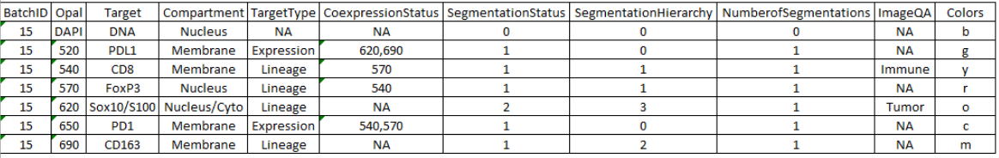

# 4.4.8. MergeConfig Tables
Merge Configuration file is a csv spreadsheet which indicates how the markers will be analyzed and merged to a single coordinate system where only one phenotype call exists for each cell. Columns are defined below, column names are case senstitive. Mark fields that do not have a designation as NA in character columns and 0s in numeric columns. Additional information on the merge can be found in the ```MaSS``` documentation [here](../../../hpfs/mergeloop/MaSS#merge-a-single-sample-mass)



- ```BatchID[int]```: indicates which batch the slides were stained in. This variable is used a record keeping method and does not indicate settings in the merge code
- ```Opal[int]```: should be the name of the Fluor which targets a given antibody
   a. stains should be added in numeric order starting with DAPI
- ```Target[string]```: name if the antigen the applied antibody is targeting
   - name does not need to be very technical by should unique
   - the name should also be used for:
      - the opal labels in inForm
      - the positive phenotype for each marker
      - the folder for each of the separate inForm outputs
      - **Exception**: the tumor marker (also designated in ImageQA)
        - For this marker, use 'Tumor' to desgnate the output folder
        - Optionally: use 'Tumor' when desgniating that antibody in inForm. 
        - Must use same name for phenotype and opal namings
- ```Compartment[string]```: The cell compartment from the inForm tables to use when loading in the database. Options include ```EntireCell```, ```Membrane```, ```Nucleus```, and ```Cytoplasm```
- ```TargetType[string]```: 'Lineage' or 'Expression'
   - 'Lineage'
     - use this to denote markers that define the cell type\ function (e.g. Macrophages, TCells, Tumor cells, Tregs)
   - 'Expression':
     - Markers that may be expressed at varying levels on many given cell types (e.g. PD1, PDL1) and will not affect the phenotype call of other cells 
- ```CoexpressionStatus[float]```: **different for Expression and Lineage phenotypes**
   - *Exrpression markers*: input the opal dyes of the lineage marker(s) it predominately co-expresses with
     - e.g. PD1(650) may co-expresses predominantly with CD8 (540) and FoxP3 (570), add 540,570 to this input for PD1
   - *Lineage markers*: input the opal dyes of **other Lineage marker(s)** that will be allowed to co-express with the specified marker
     - e.g. if CD8+ (540) - FoxP3+ (570) cells are accepted; in the CD8 row add “570” for FoxP3 and in the FoxP3 row add “540” for CD8
- ```SegmentationStatus[int]```: This is a numeric value; 1-X for the different types of segmentation that may exist, each marker with the same number should be processed with the same cell segmentation algorithm in inform
   - e.g. for a specified panel all markers may have the same segmentation and would have (1)s except Tumor which would have (2)s
   -	The primary segmentation (1) should be the more reliable algorithm and usually correspond to smaller cells
   -	“Other” cells will be defined by the primary segmentation (1)
- ```SegmentationHierarchy[int]```: *For Lineage markers only*; create an order of phenotypes/ segmentation you believe will be most accurate – this is primarily based off of cell morphology 
   -	Use NA for expression markers
   -	The code will remove cells according to this column
     - lower cells take precedence over higher number cells when they collide
     - e.g.: A cell given a positive phenotype for CD8 in the CD8 algorithm and positive for CD163 in the CD163 algorithm; if CD8 (1) is ranked higher than CD163 (2) then the CD163 designation will be removed
   - Only cells that are allowed co-expression should have the same number. If two cells co-express with the same cell but not each other (CD4-FoxP3 and CD8-FoxP3); use the higher number for one of the two cells (CD4 or CD8) and the double co-expressed cell (FoxP3). Use a lower number for the other cell (CD4 or CD8). In the example with CD8-CD4-FoxP3 we usually use the numbers 1-2-1. CD4-FoxP3 will still be found based off of co-expression status but CD8-FoxP3 cells will take precedence.
-	```NumberofSegmentations[int]```: this value indicates how many segmentations were used for each antibody
    - as of the current update this setting is only supported on markers designated as ‘expression’
    - lineage cells that are from separate segmentations but are allowed to coexpress will create unexpected results 
-	```ImageQA[string]```: This column allows a user to set 2 different conditions of the batch
    -	'Immune': The user can set one cell type as the ‘Immune’ cell 
      - Fields with the highest density of this cell type will be selected by the CreateImageQAQC algorithm to be assessed
      - there needs to be at least one and only one of these designations for the MaSS code to work
    -	'Tumor': The user can set one cell type as ‘Tumor’
       - This is an optional field and will tell the code to narrow down the QA to fields to only include those with more than 60 of this cell type
       - There can be only one cell of this type
    -	Only set one marker as ‘Immune’ and only one marker as ‘Tumor’
- ```Colors[string]```: specify the colors for the create image qa qc protocol. Colors can be specified by the color name or abbreviations below.
    - Options: 'red','green','blue','cyan', 'magenta','yellow','white','black','orange','coral'
    - Abbreviations: 'r','g','b','c','m','y','w','k','o','l'
