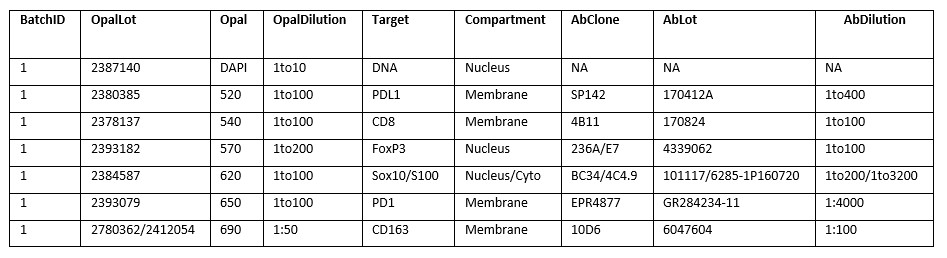
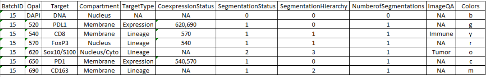

# 3. Setting Up, Organization, and Scanning
## 3.1. Description
The AstroPath Pipeline requires that a number of experimental protocols are understood and followed for the code to work. These protocols include methods for slide scanning, slide naming, regent tracking, and directory organization. This section of the documentation describes these protocols and provides important definitions for terms used throughout the AstroPath Pipeline documentations. Additionally, there is a main directory, refered to as the ```<Mpath>```, which contains a set of csv files. These files contain pertinent information which drive processing such as directory locations, machine names, slide names, and project identifiers. These csv files are defined in [3.4](#34-astropath_processing-directory-and-initializing-projects "Title")

## 3.2. Definitions
### 3.2.1. Identification Definitions
- ```Method[String]```: This is the staining method. Either:
  - *Manual*: manually stained
  - *Automatic*: stained by an automatic stainer (E.g. *Lecia Bond Rx*)
- ```Panel[String]```: For each unique set of antibodies we have provided an idenitifying name.
   - E.g. *PD1\PDL1 Axis*. 
- ```Tissue[String]```: The tissue the panel was stained on
- ```Machine[string]```: The user defined name of the microscope the machine was scanned on. 
   - This specifier is used to find particular files needed for processing a of specified microscope, particularly the image warping parameters. 
   - Traditionally the microscopes are named with a three letter location specifier, followed by the machine type (Polaris, Vectra3), then underscore and a numeric value. 
   - E.g. *JHUVectra3_1*
- ```StainConfig[int]```: The stain configuration is a unique numeric value for a ```Machine, Method, Panel``` pairing. 
- ```Cohort[int]```: A unique numeric identifier for a set of patient samples. 
   - Cohorts can belong in multiple ```Projects``` if stained with different ```StainConfig```s.
- ```Project[int]```: Defined as a set of slides, or ```Cohort```, stained with a single ```Panel``` and ```Method``` then scanned by a single ```Machine```.
   - These values are unqiue and are defined at the start of processing then used throughout the code to identify that project. 
   - All data for a specified project should be placed in a single folder. 
- ```Batch[int]```: The unique numeric value for a batch of slides stained together. 
   - For each unique ```Project```, each set of ```BatchID```s are separate and usually starts over at 1. 
   - Additional details on ```BatchID```s can be found below in [3.3](#33-scanning-verifying-complete-and-adding-batchids "Title").
- ```SampleName[string]```s: The ```SampleName```s are the names defined during the scanning process
   - These names are replaced and standarized as part of the pipeline. 
   - The code detects these from the *SpecimenTable.xlsx* files contained in each cohort scanning folder. 
   - A description of the *SpecimenTable.xlsx* file is in [3.3](#33-scanning-verifying-complete-and-adding-batchids "Title") repository.
- ```SlideID[string]```s: The names for the specimens in the astropath processing pipeline 
   - These names replace the ```SampleName```s on all corresponding files and inside the scanning plan, annotations.xml, files generated during the scanning process.
   - Using these names allows us to avoid outside the organization changes to naming conventions.
   - The IDs have the format; ```APpppXXXX```
     - ```ppp``` indicates the numeric ```ProjectID```
     - ```XXXX``` is a slide number which is unique within a project
   - The IDs are generated by comparing the *AstropathAPIDdef_PP.csv* to the cohort specific *SpecimenTable.xlsx*
     - we assign each new specimen with a new value in sequential ordering (AP0010001, AP0010002, AP0020001 …) 
     
### 3.2.2. Path Definitions
The file pathes have been standarized and are described below. Additional examples and directions for intialization of these paths can be found in [3.4](#34-astropath_processing-directory-and-initializing-projects "Title"). **A full file tree layout can be found in**.
- ```<Mpath>```: The main path for all the astropath processing *.csv* configuration files.
  - The current location of this path is ```\\bki04\astropath_processing```.
  - A description of each file is located below in [3.4](#34-astropath_processing-directory-and-initializing-projects "Title")
- ```<Dname>```: The data folder name or the name of the clinical specimen folder. 
   - E.g. “Clinical_Specimen_7” 
- ```<Dpath>```: The data or destination path up to but not including the ```<Dname>```
  - such that the full path to the data is ```\\<Dname>\<Dpath>```
- ```<Spath>```: The source path of the data up to but not including the  ```<Dname>```
  - such that the full source path of the data is ```\\<Spath>\<Dname>```
  - usually indicates a subdirectory on a server where the microscope is backed up to after scanning is complete.
  -  E.g. “\\tme1\VectraPolaris\Vectra Polaris 1 Scanning” 
- ```<Cpath>```: The compression path of the data up to but not including the ```<Dname>```
  - such that the full compression path of the data is ```\\<Cpath>\<Dname>```
  - Here the compressed backup the im3 image files and final Tables\ component data tiffs are stored after the pipeline has finished processing. 
  - E.g. “bki03\Compressed_Clinical_Specimens”
  - E.g. “bki03\Compressed_Clinical_Specimens_2”
- ```<FWpath>```: This is the full path for the single column flat field and warping image (.fw) as well as the exposure time data for each image (.SpectralBasisInfo.xml). 
   - This path should preferably located on a different drive from the main path to improve pipeline performance. 
   - E.g. “bki03\flatw_7”
   - Usually the specifier used on the ```<Dname>``` folder is also found as an extension on this folder
   - ***Additional details on these files can be found in the flatw workflow description***

*NOTE*: the ```<path>``` variables do not contain the ```<Dname>```

## 3.3. Scanning, Verifying Complete, and Adding BatchIDs
Before scanning it is important to set up the ```<spath>```. This folder is created on the scanning computer where slides are scanned into. The folders are usually labeled *Clinical_Specimen_N*, where the *N* indicates a numeric value or unique lettering. Examples of these scanning folders incude *Clinical_Specimen_2* and *CLinical_Specimen_BMS_01*. In the JHU processing pipeline, this folder is backed up every night to a network server with significant storage capacity (~80TB) using commercially available software. In this way once slide scans are completed they can be deleted from the computer in such a way that the computers never run in storage issues. *NOTE*: The fully qualified path for this scanning folder on the server is designated as the ```<spath>```. 

After a new batch of slides are stained, they should be added to a *Specimen_Table_N.xlsx* file located in each ```<spath>```, described in detail below in [3.3.1](#331-specimen_table "Title"). As part of adding slides to this table, the slides will be given a unique de identified name for scanning. Tips on these names are included in [3.3.2](#332-samplenames-patient--or-m-numbers "Title"). The most important aspect of this convention is to avoid the use of spaces and special characters. For each batch, a control tma should also be stained and scanned. The scanning and naming of this slide is also very important for pipeline ingestion and is defined below in [3.3.3](#333-control-tma-conventions "Title"). *Note*: The control tmas do not go into the *Specimen_Table_N* and are found based on their **naming**.

Once added to the *SpecimenTable.xlsx*, slides can be scanned with 20% overlap according to the protocol laid out in [3.3.4](#334-whole-slide-scanning "Title"). In order for successful processing of the slides, it is very important that this procedure is adhered to correctly. After slides are scanned, the user should manually verify that all images were scanned completed properly and add a *BatchID.txt* file to the successful ```Scan``` directory. This initiates the slide transfer process in the pipeline, additional details on this step are defined in [3.3.5](#335-batchids "Title"). It is also important to create the *Batch_BB.csv* and *MergeConfig_BB.csv* files for processing to continue successfully. Each staining batch defined should have a separate set of these tables. Information on these files can be found in [3.3.6](#336-batch-tables "Title") and [3.3.7](#337-mergeconfig-tables "Title"), respectively. 

### 3.3.1. Specimen_Table
The specimen table is used to intialize the slides and servers as the link between the de identified slide ids and the clinical specimen ids. The specimen table should be labeled *Specimen_Table_N.xlsx*, where *N* stands for the same unique specifier on the *Clinical_Specimen_N* folder. This file should always be contained on a HIPAA complinant location. The file has the following columns:
```
Patient #, Specimen #, Cut Data, Level, Batch ID, Stain Date, Scan Date
```
- ```Patient #```: this is the ```SampleName``` defined in [3.2.1](#321-identification-definitions "Title")
- ```Specimen #```: this the specimen number that is used to identify the patient clinical information
- ```Cut Date```: the date that the slide was cut from the tissue block
- ```Level```: the cut number from the sections cut on that date
- ```Batch ID```: the staining batch the slides was stained with, more details below in [3.3.4](#334-batchids “Title”).
- ```Stain Date```: the date the slide was stained on 
- ```Scan Date```: the date the slide started HPF scanning

### 3.3.2. SampleNames (Patient # or M Numbers)
In order for the slide to be processed through the pipeline, it must be given its own de-identified number. These are the so called ```SampleName``` (in past versions ‘M’ numbers or ```Patient #```s). For these ```SampleName```'s each cohort will receive its own alphabetical key. Currently we are using:
-	*M* for melanoma
-	*L* for Lung
-	*MA* for melanoma stain 2

Within a cohort every slide stained will receive a new numeric value attached to the ```SampleName```s, the order of these do not matter. Examples for the first four slides stained of a cohort may be:
- *M1*, *M2*, *M3*, *M4*
- *M9*, *M100*, *M42*, *M35_3*

If a Batch fails these slides should still receive a ```SampleName``` and show up in the *Speciment_Table_N.xlsx*. 

### 3.3.3. Control TMA Conventions
Each staining batch should be stained with a control TMA. The control TMAs are used to:
- assess the quality of staining performed on a given staining run
- normalize the data as part of the database upload
When scanning the slides should be named *Control_TMA_XXXX_ZZ_MM.DD.YYYY*
- XXXX is the TMA ID
-	ZZ is the TMA cut number
-	MM.DD.YYYY is the month, day, and year of staining
*NOTE*: The ‘Control’ designation is provided so that we can appropriately select and handle the control tissues automatically

### 3.3.4. Whole Slide Scanning
This section describes the methods for whole slide scanning. The directions here assume that the user has some working knowledge of how the Akoya multiplex microscopes function. While a skilled user of the Akoya platform would be able to easily acquire whole slide imagery, the directions here provide nuances that must be adhered to for successful slide processing in the AstroPath Platform. Failure to adhere to these guidelines may crash the pipeline and render whole slide imagery incompatible with the AstroPath Platform. This section is started with directions for configuring the [20% field overlap](#3341-preparing-20-overlap "Title"). This is followed up with steps taken to scan\ evaluate the [control tmas](#3342-scan-the-control-tma "Title") and [whole slide samples](#3343-scan-the-whole-slide-specimens "Title"). Again these instructions assume that the user has working knowledge of the Akoya platform and should not be used in lieu of proper microscope training. Next, a brief description on how to create a [whole slide scanning plan](#3344-creating-a-whole-slide-scanning-plan "Title") is provided. Finally, [key notes and specifications](#3345-important-scanning-notes "Title") are provided for scanning. These notes are particularly important and should be reviewed carefully.

#### 3.3.4.1. Preparing 20% overlap
As part of the AstroPath Pipeline, slides must be scanned with fields that overlap by 20%. We use this overlap to measure and/ or correct for errors in imagery, including warping, illumination, segmentation, and positioning. This is step should be performed on each computer that will be used to create scanning plans in *Phenochart(C)*. The changes made are permant and should only need to be performed once for a computer.
1. Install the lastest version of *Phenochart(C)*
2. Be sure that *Phenochart(C)* is shut down
3. Go to *C:\ProgramData\PerkinElmer\Phenochart\* (Please note that ProgramData is usually a hidden folder)
4. Copy and paste the *Phenochart.config* file with one that does 20% overlap (a version of this is located in this folder)
5. Check ‘ROIs with overlap’ as on under the settings in *Phenochart(C)*

#### 3.3.4.2. Scan the *Control TMA*
1. Take references for the microscope
2. When a batch is finished staining we first check that the slides are designated in the *Specimen_Table_N* ([3.3.1](#331-specimen_table “Title”)).
   - If the slide is designated in the *Specimen_Table_N*; check that the ‘M’ numbers are written on the slides and that they are the correct numbers
   - If the slide is not designated in the *Specimen_Table_N* insert the required information and give the slides ```SampleName```s corresponding to the next available number (again values should not be repeated even if a batch fails)
3. Set up the scanning exposures (the ‘Protocol’) for the TMA in the proper ```<spath>``` folder
   - Name the protocol and the task list-> *Control_TMA_XXXX_YYY*
     - XXXX -> the TMA ID (ie. 1372)
     - YYY -> the TMA cut number (ie. 126)
     - Old scanning protocols will be located in any Clinical_Specimen folder under Protocols 
4. Name the control TMA slide -> *Control_TMA_XXXX_ZZ_MM.DD.YYYY*
   - XXXX is the TMA ID
   - ZZ is the TMA cut number
   - MM.DD.YYYY is the month, day, and year of when staining finished
5. Scan the whole slide overview on the microscope
6. Create an annotation scanning plan in Phenochart
   - Open the TMA in  Phenochart
   - Click ‘Login’ at the upper left-hand corner
     - Type your name or initials
    - Click ‘TMA’ in the upper middle of the screen
      - Change the plan so that the bottom right TMA is [1,1]
    - Change ‘core size’ to 1.5 mm
    - Change the ‘Imaging Size’ to ‘3x3’ Image
    - Draw the rectangle around all cores for Phenochart to locate the cores
    - To do this click and hold near one of the corners and drag across to the opposite corner (a search box should be displayed by Phenochart)
    - If a core is missing right click the location of the core and select ‘Add missing core’ then select the proper core
    - If the cores are mislabeled you will have to start over and draw a new box (select ‘clear grid’ at the top to start over)
    - Center the squares around the expected center of the Cores
      - To center the cores click and hold ‘Ctrl’ 
      - With the mouse click the center of one of the cores and move it
      - If much of the core is missing, still center around what would be the expected center
        - Because we do not correct for image distortion effects in the TMAs, if one core is missing half its tissue we still want to image the other half in the same way we would regularly
      - Once you are satisfied click ‘Accept Grid’ and close Phenochart
7. Select the ‘Acquire MSI fields’ task for the TMA on the microscope and scan the slide
8. Do the quality control of the TMA
   - Open three cores from a previous Control TMA in inForm
     - Be sure that the TMA cores came from the same cohort and from a Batch that worked 
     - Example Cores for methods would include:
   - Open the same three cores from the current TMA in inForm
     - The ‘Core’ coordinates should be the same between batches
   - Open an Algorithm with a current library
   - Prepare all images with the library 
   - Compare the counts and the stain quality between the old and the new TMA
     - Click on the icon with the box next to a mouse pointer to compare the counts between the old and new  TMAs
     - It is easiest to write down the Opal and its respective counts range on a sheet of paper to refer to when switching between old and new versions
     - The colors are always as follows
       - Opal520 – Green
       - Opal540 – Yellow
       - Opal570 – Red
       - Opal620 – Orange
       - Opal650 – Cyan
       - Opal690 – Magenta 
     - Look to see if general patterns are the same and if intensities vary
     - It is usually easy to see differences visually and use counts as a sanity check for your eyes
     - Because the of the similarities in the cores and stains within a cohort the variation between slides should be minimal
9. Give the TMA a *BatchID.txt* file and give it the next corresponding ```BatchID```
10. Fill in the ```BatchID``` on the *Specimen_Table_N.xlsx* if it is not already present

#### 3.3.4.3. Scan the Whole Slide Specimens
If everything checks out scan the specimens as follows:
1. Take exposures (create a single protocol) for all of the specimen multiplex slides 
    - The name of the protocol should be *Multiplex_MMDDYYYY* 
    - and should be saved to the corresponding ```<spath>``` folder
2.	Create a task list (.csv format) for the scanning
    - It should be named Multiplex_MMDDYYYY.csv
3.	Load the slide carrier with the slides
    - Clean the slides using a Kimwipe to remove dust and excess mounting medium
    - Load the carrier from bottom to top so that the first slide corresponds to Slot 1 on the Task list
4.	Scan the whole slide overview on the microscope
5.	Create the annotation file for the [Whole Slide Overlap imagery](#3344-creating-a-whole-slide-scanning-plan "Title")
6.	Acquire HPFs on the microscope
7.	If using a network storage server, wait for data to backup
    - Manually check that the image files are in both the local and backup locations
      - Open two windows explorers, one for the local and one for the backup location
      - Check that the same number of im3s exist in both locations 
      - Sort by ‘Size’ in the windows explorer to be sure that all of the images are the same size
        - If there is a file with 0 bytes, check for M# duplicate file. This is the only time variation in field size is allowed, see ‘Notes’ section below for details on how to handle M# files.
      - Check that the annotation.xml modified data are the same
8. Check that the data scanned properly
   - Open the overview scans in *Phenochart(C)* and check that at least 95% of the fields correctly scanned
      - Never retake single HPFs, if more than 5% of fields failed restart the entire HPF set. 
      - By making the image files 'extra large icons' a quick visual inspection can be performed of the slides. Here check for two things:
        - sometimes the microscope gets mixed up and scans the wrong part of the tissue, usually this creates a number of empty fields but can be hard to catch 
          - the AstroPath Pipeline code has been modfied to handle such cases so this is not a breaking issue but does cause a loss of data.
        - sometimes the microscope will automatic focus will fail and fields will be blurry
        - In both cases rescan the HPFs
9. If using a network server for microscope backup, delete the local copy of the data 
10.	Add the *BatchID.txt*, described above, to the proper ‘Scan’ folder

#### 3.3.4.4. Creating a Whole Slide Scanning Plan
1.	Take lower power overview scan as normal
2.	Open Phenochart and select ROI
3.	Circle the entire tissue, click OK on dialog box that appears
4.	Delete empty fields around and inside tissue boundaries

#### 3.3.4.5. Important Scanning Notes
1.	To scan multiple pieces of tissue:
    - if they are close enough that there is asymmetric overlap between tissues include them in the same ROI drawing
    - If there is no overlap between fields; circle the ROIs separately 
2. Include the entire tissue: folds, necrosis, etc. 
3. If a large number of HPFs fail in slide scanning, rescan the QPtiff to create a Scan2 (or next Scan number) folder, draw a new ROI, and start the scan over (do not delete Scan1 folder)
   - This is a way to track for errors, remove human interaction with the data, and reduce issues that may come up due to multiple scans
   - It is possible to manually create a Scan2 folder and copy the QPtiff from Scan1 (renaming all files to Scan2), if you do this be sure to delete the annotations.xml file in Scan2 before drawing a new ROI
   - Much of our codes look to the .xml files to determine the expected number of .im3 files
4.	If only a few HPFs fail do not rescan them
5.	If it is a core biopsy and two cuts have been placed on the same slide; only select HPF annotation for one
6.	Some files may end up with an ‘_M#.im3’ designation at the end of the file name. This means that the HPF was scanned twice. The duplicate is labeled with the ‘M2’ designation, but the initial scan has no designation and has 0 bytes. Do not delete either file. This is issue is dealt with in the automated pipeline.

### 3.3.5. BatchIDs
For some cohorts not all slides can be stained at the same time. A ```BatchID``` specifies a group of slides that were stained together. We use this information in the pipeline both for batch to batch normalization and to create an illumination correction for each batch. We correct for illumination for each batch because the light patterns for a given microscope should be the most consistent during the scanning of a single batch. In this way we can also make sure microscope maintaince never has an effect on scanning by doing any such maintaince between batches. The ```BatchID```s are project dependent such that numbers may be reused for different projects. When specifiying a ```BatchID``` it is usually best to use a two-digit integer (for values less than 10 use 01).

After a scan is completed, it should be manually verfied as complete. There are a few ways to do this, see [3.3.4.3 Part 8](#3342-scan-the-control-tma "Title"). In the successful ‘ScanN’ folder there should be a text file named *BatchID.txt*. This file will indicate the folder that will be transferred and used in the data pipeline all other Scan folders generated by the Vectra scanning softwares are ignored. This file should only be added once all HPFs have been confirmed as successfully scanned. This text file should contain the numeric value of that ```BatchID```.

### 3.3.6. Batch Tables
For each ```BatchID``` a *batch table* should be created, this file records the staining\ reagent information for that batch including lot numbers and antibody-opal pairs. These tables should be added to a *Batch* folder in the ```<Dpath>\<Dname>``` folder The full directory structure for the ```<Dname>``` folder can be found in [3.5](#3.5-directory-organization "Title"). Typically the person who performs the slide staining for a batch has the best access to this information. As such they should fill out this document and add it to the appropriate location as possible after staining to avoid delays. 

The *batch tables* should be named *Batch_BB.xlsx*, replacing the *BB* with the repective ```BatchID```. The tables should contain the following columns:
```
BatchID, OpalLot, Opal, OpalDilution, Target, Compartment, AbClone, AbLot, AbDilution
```
New and ambigious columns\ variables are described below:
- ```Target[string]```: name if the antigen the applied antibody is targeting
   - name does not need to be very technical by should unique
   - the name should also be used for:
      - the opal labels in inForm
      - the positive phenotype for each marker
      - the folder for each of the separate inForm outputs
      - **Exception**: the tumor marker (also designated in ImageQA)
        - For this marker, use 'Tumor' to desgnate the output folder
        - Optionally: use 'Tumor' when desgniating that antibody in inForm. 
        - Must use same name for phenotype and opal namings
- ```Compartment```: The cell compartment from the inForm tables to use when loading in the database. Options include ```EntireCell```, ```Membrane```, ```Nucleus```, and ```Cytoplasm```
*NOTE*: When adding to the OpalLot, Opal, AbClone, and ABLot columns in excel spreadsheets be sure to add a single quote (') before the value, to specify that the column is a string and not a number. Always use the *1to* designation for concentrations.

There should be a row for each stain applied to the batch. The stains should start with DAPI then added in increasing opal order. An example table from the *Vectra 3.0* microscope is shown below:



### 3.3.7. MergeConfig Tables
Merge Configuration file is a csv spreadsheet which indicates how the markers will be analyzed and merged to a single coordinate system where only one phenotype call exists for each cell. Columns are defined below, column names are case senstitive. Mark fields that do not have a designation as NA in character columns and 0s in numeric columns. ***Additional information on the merge can be found in the ```MaSS``` documentation.***



- ```BatchID[int]```: indicates which batch the slides were stained in. This variable is used a record keeping method and does not indicate settings in the merge code
- ```Opal[int]```: should be the name of the Fluor which targets a given antibody
   a. stains should be added in numeric order starting with DAPI
- ```Target[string]```: name if the antigen the applied antibody is targeting
   - name does not need to be very technical by should unique
   - the name should also be used for:
      - the opal labels in inForm
      - the positive phenotype for each marker
      - the folder for each of the separate inForm outputs
      - **Exception**: the tumor marker (also designated in ImageQA)
        - For this marker, use 'Tumor' to desgnate the output folder
        - Optionally: use 'Tumor' when desgniating that antibody in inForm. 
        - Must use same name for phenotype and opal namings
- ```Compartment[string]```: The cell compartment from the inForm tables to use when loading in the database. Options include ```EntireCell```, ```Membrane```, ```Nucleus```, and ```Cytoplasm```
- ```TargetType[string]```: 'Lineage' or 'Expression'
   - 'Lineage'
     - use this to denote markers that define the cell type\ function (e.g. Macrophages, TCells, Tumor cells, Tregs)
   - 'Expression':
     - Markers that may be expressed at varying levels on many given cell types (e.g. PD1, PDL1) and will not affect the phenotype call of other cells 
- ```CoexpressionStatus[float]```: **different for Expression and Lineage phenotypes**
   - *Exrpression markers*: input the opal dyes of the lineage marker(s) it predominately co-expresses with
     - e.g. PD1(650) may co-expresses predominantly with CD8 (540) and FoxP3 (570), add 540,570 to this input for PD1
   - *Lineage markers*: input the opal dyes of **other Lineage marker(s)** that will be allowed to co-express with the specified marker
     - e.g. if CD8+ (540) - FoxP3+ (570) cells are accepted; in the CD8 row add “570” for FoxP3 and in the FoxP3 row add “540” for CD8
- ```SegmentationStatus[int]```: This is a numeric value; 1-X for the different types of segmentation that may exist, each marker with the same number should be processed with the same cell segmentation algorithm in inform
   - e.g. for a specified panel all markers may have the same segmentation and would have (1)s except Tumor which would have (2)s
   -	The primary segmentation (1) should be the more reliable algorithm and usually correspond to smaller cells
   -	“Other” cells will be defined by the primary segmentation (1)
- ```SegmentationHierarchy[int]```: *For Lineage markers only*; create an order of phenotypes/ segmentation you believe will be most accurate – this is primarily based off of cell morphology 
   -	Use NA for expression markers
   -	The code will remove cells according to this column
     - lower cells take precedence over higher number cells when they collide
     - e.g.: A cell given a positive phenotype for CD8 in the CD8 algorithm and positive for CD163 in the CD163 algorithm; if CD8 (1) is ranked higher than CD163 (2) then the CD163 designation will be removed
   - Only cells that are allowed co-expression should have the same number. If two cells co-express with the same cell but not each other (CD4-FoxP3 and CD8-FoxP3); use the higher number for one of the two cells (CD4 or CD8) and the double co-expressed cell (FoxP3). Use a lower number for the other cell (CD4 or CD8). In the example with CD8-CD4-FoxP3 we usually use the numbers 1-2-1. CD4-FoxP3 will still be found based off of co-expression status but CD8-FoxP3 cells will take precedence.
-	```NumberofSegmentations[int]```: this value indicates how many segmentations were used for each antibody
    - as of the current update this setting is only supported on markers designated as ‘expression’
    - lineage cells that are from separate segmentations but are allowed to coexpress will create unexpected results 
-	```ImageQA[string]```: This column allows a user to set 2 different conditions of the batch
    -	'Immune': The user can set one cell type as the ‘Immune’ cell 
      - Fields with the highest density of this cell type will be selected by the CreateImageQAQC algorithm to be assessed
      - there needs to be at least one and only one of these designations for the MaSS code to work
    -	'Tumor': The user can set one cell type as ‘Tumor’
       - This is an optional field and will tell the code to narrow down the QA to fields to only include those with more than 60 of this cell type
       - There can be only one cell of this type
    -	Only set one marker as ‘Immune’ and only one marker as ‘Tumor’
- ```Colors[string]```: specify the colors for the create image qa qc protocol. Colors can be specified by the color name or abbreviations below.
    - Options: 'red','green','blue','cyan', 'magenta','yellow','white','black','orange','coral'
    - Abbreviations: 'r','g','b','c','m','y','w','k','o','l'

## 3.4. AstroPath_Processing Directory and Initializing Projects
The code is driven by the files located in a main processing folder, named the ```<Mpath>```. These files are described below followed by descriptions of the respectve columns. For columns without definitions provided, please check [3.2](#32-definitions "Title") above. After a description of the directory and files included, instructions for intializing projects into the pipeline are provided.

### 3.4.1. AstroPath_Processing Directory
- *AstropathCohortsProgress.csv*: This file contains information on the project's analysis status and important experimental variables. This table is manually updated. The file has the following columns:
  ```
  Project, Cohort, Dpath, Dname, Machine, Method, Panel, Tissue, StainConfig, Stain, Scan, Inform, Merged, QC, Annotations, ReadyForDB, DBLoad
  ```
  - ```Stain[string]```: The staining status of the panel. Should be indicated as blank (not started), *Started*, or *Done*.
  - ```Inform[string]```: The status of the inform algorithm for classification and segmentation. Should be indicated as blank (not started), *Started*, or *Done*.
  - ```Merged[string]```: The status of the inform processing and merge. Should be indicated as blank (not started), *Started*, or *Done*.
  - ```QC[string]```: The status of the quality control assessment of samples. Should be indicated as blank (not started), *Started*, or *Done*.
  - ```Annotations[string]```: Whether or not the slide annotations have been created for a panel. ***Annotation directions can be found in***. Should be indicated as blank (not started), *Started*, or *Done*.
  - ```ReadyForDB[string]```: Indicates whether final checks for the manual interaction steps with the data have been complete. ***A full checklist is still in progress.***. Should be indicated as blank (not started), *Started*, or *Done*.
  - ```DBLoad[string]```: The current status of the database load. Should be indicated as blank (not started), *Started*, or *Done*.
- *AstropathConfig.csv*
- *AstropathControldef.csv*
- *AstropathPaths.csv*
- *AstropathSampledef.csv*
- *AstropathAPIDdef.csv*

### 3.4.2. Initializing Projects

## 3.5. Directory Organization 
The following folders should exist in the ```<Dpath>\<Dname>``` for processing. The code initializes these folders at the start of the pipeline.
1.	```upkeep_and_progress```
    - For any upkeep and progress tracking files
    - Location of the *AstropathAPIDdef_PP.csv* files, where ```PP``` indicates the numeric project id
2.	```flatfield```
    - Location of the flatfield parameter files
    - These files are named ```Flatfield_BatchID_BB.bin```, replacing the ```BB``` for the appropriate batch id.
3.	```logfiles```
    - Project level log files for the astropath pipeline 
4.	```Batch```
    - The batch and merge tables
    - These tables are described in further documentation located in the [AstropathJHU/AstropathPipeline](https://github.com/AstropathJHU/AstropathPipeline "Title") repository
5.	```Clinical```
    - Location of the clinical table
    - These tables should be labeled as *Clinical_Table_Specimen_CSID_MMDDYYYY.csv*, where the ```CSID``` indicates the number on the ```<Dname>``` folder. 
    - We always use the clinical table with the most recent date in the data upload
6.	```Ctrl```
    - Location of control TMA data output
7.	```dbload```
    - Location of the files used for the database upload
8.	```tmp_inform_data```
    - Location of the inform data output and inform algorithms used. **Additional information on this folder is provided in the hpf processing documentation.**
9.	```reject```
    - Location of the rejected slides

